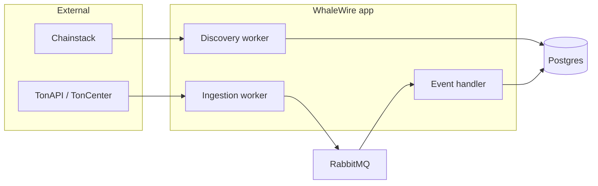

# Launch, architecture, and monitoring

Short reference for running WhaleWire locally and finding metrics, alerts, and queues.

---

## Launch the app

1. Copy `env.example` to `.env` and set at least `POSTGRES_PASSWORD` and `RABBITMQ_PASSWORD` (and API keys if you use real TON APIs).
2. From the repo root:

```bash
docker compose up -d
```

3. **App:** http://localhost:5007 — health: `/health`, Prometheus text: `/metrics`
4. **Postgres:** `localhost:5432` (user `whalewire`, DB `whalewire`)
5. **RabbitMQ AMQP:** `localhost:5672` — **management UI:** http://localhost:15672 (user/password from `.env`)

Stop: `docker compose down`

---

## Architecture (high level)



- **Discovery** — pulls top accounts, writes `monitored_addresses`.
- **Ingestion** — polls TON APIs per address, publishes `BlockchainEvent` to RabbitMQ, updates checkpoints.
- **Handler** — consumes events, idempotent insert, alerts, circuit breaker.

Code layout: **Domain** (`WhaleWire.Domain`), **application use cases** (`WhaleWire.Application`), **infrastructure** (TON clients, Postgres, RabbitMQ under `WhaleWire.Infrastructure.*`), **host** (`WhaleWire` — workers, `Program.cs`). Deeper detail: [ARCHITECTURE.md](ARCHITECTURE.md).

---

## Where monitoring lives

| What | URL / place | Use for |
|------|-------------|---------|
| **Grafana** | http://localhost:3000 | Dashboard **WhaleWire overview**: DLQ, circuit breaker, discovery count, max event lag, seconds since discovery success, alert rate, ingest rate (total + per chain), max lag trend, alerts rate (total + by direction). Login: `admin` / `GRAFANA_ADMIN_PASSWORD` in `.env`. |
| **Prometheus** | http://localhost:9090 | Raw metrics, PromQL, **Alerts** tab (rule state). Scrapes the app’s `/metrics` every 30s. |
| **Alertmanager** | http://localhost:9093 | Firing/resolved alerts (DLQ, circuit breaker open, stalled ingestion, etc.). Receivers are in `prometheus/alertmanager.yml`. |
| **App metrics** | http://localhost:5007/metrics | Same series Prometheus scrapes; useful for curl/debug. |
| **RabbitMQ UI** | http://localhost:15672 | Queue lengths, **including DLQ** `*.dlq` — ground truth next to `whalewire_dlq_messages_total`. |

Metric names (also on the Grafana dashboard): `whalewire_dlq_messages_total`, `whalewire_circuit_breaker_state`, `whalewire_events_ingested_total`, `whalewire_event_lag_seconds`, `whalewire_discovery_*`, `whalewire_alerts_fired_total`. Alert rules: `prometheus/alerts/whalewire.yml`.

---

## Related docs

- [OBSERVABILITY.md](OBSERVABILITY.md) — metrics list and correlation-ID evidence.
- [README.md](../README.md) — quick start and troubleshooting.
